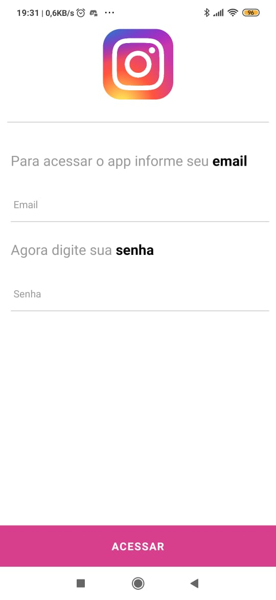
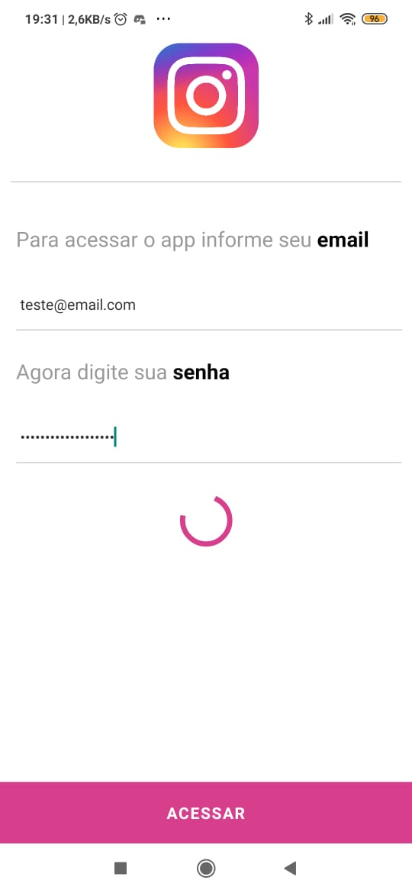
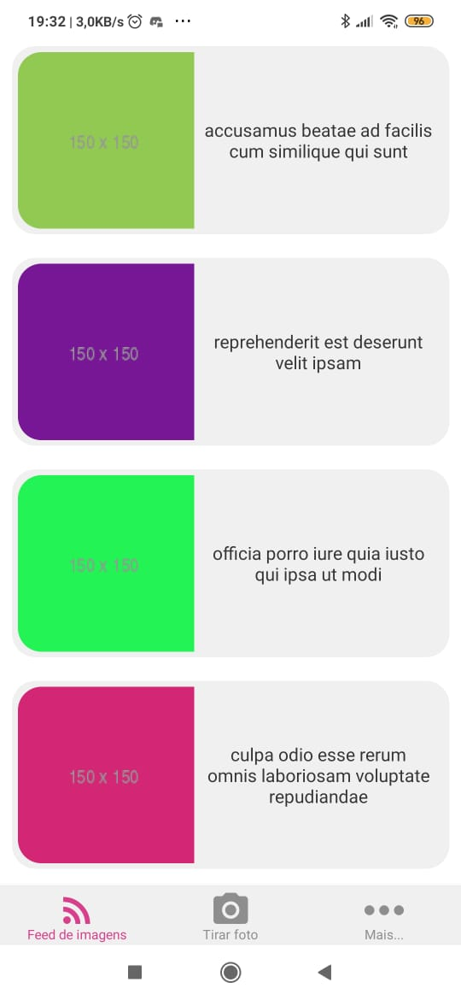
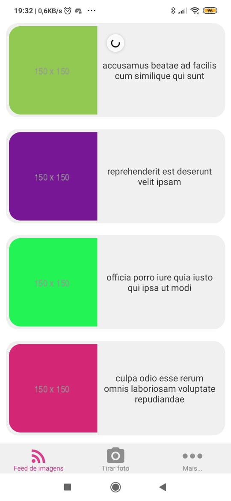
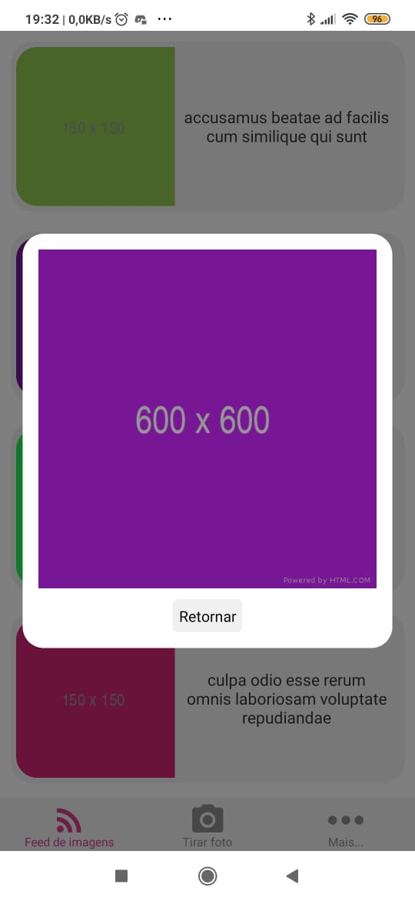
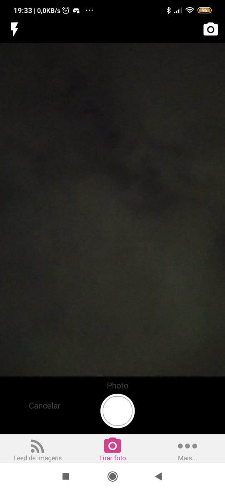
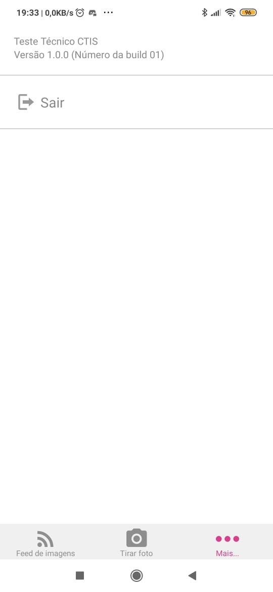
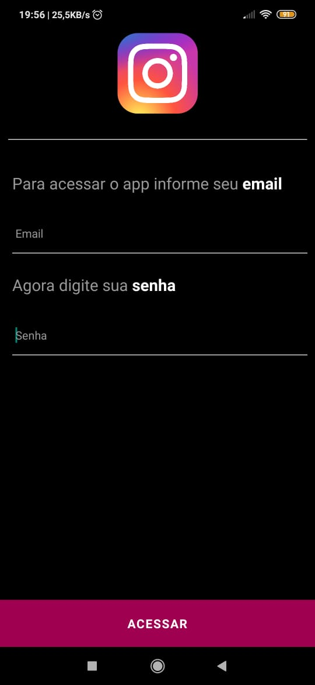
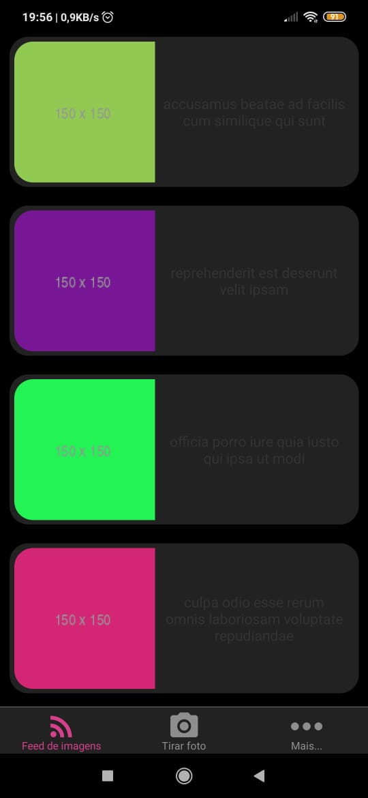
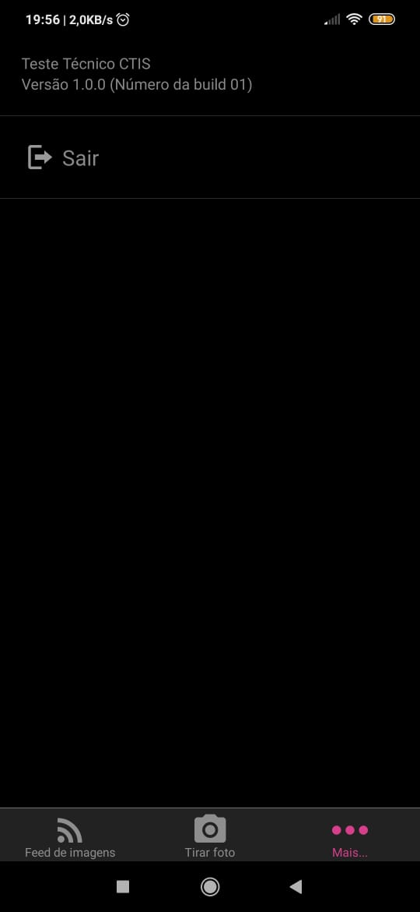

<span align="center">


[](https://github.com/patrickhl94/Projeto_Be_The_Hero/tree/master/mobile)

</span>

---
<h3 align="center">

Teste técnico em desenvolvimento mobile para ingresso na empresa Sonda

O desafio deste teste, consiste em desenvolver um app com uma interface já prototipada pela empresa, onde os principais requisitos consistiam em utilizara React Navigation para a navegação, integração com funções nativas do smathphone (Camera) e requisições HTTP em API pública.
</h3>

---

# **App desenvolvido em [React-Native](https://reactnative.dev/) - CLI**

<h3 align="center">
  Nesta aplicação, proucurei usar os recursos mais atualizados e estaveis do ecossistema React, segue abaixo as proncipais depedencias instaladas:
</h3>

````JSON
depedencias {
  "react-native-camera": "^3.23.1",
  "react-native-gesture-handler": "^1.6.1",
  "prop-types": "^15.7.2",
  "axios": "^0.19.2",
  "@react-navigation/bottom-tabs": "^5.2.7",
  "@react-navigation/native": "^5.1.6",
  "@react-navigation/stack": "^5.2.11",
  "react-native-vector-icons": "^6.6.0",
  "styled-components": "^5.1.0"
},
devDepedencies: {
  "eslint": "^6.8.0",
  "prettier": "^2.0.4",
}

````
---


  ## Estilização dos componentes

 #### Tambem optei por utilizar o `styled-componets/native` para estilizar meus componentes, considerando a facilidade que ele nos dar para inplementar variáveis e funções na estilização. Com ele ficou bem mais fácil e prático criar dois temas diferentes para esta aplicação (Temas `dark` e `light`), a seleção destes temas é automática de acordo com opção de tema do usuário, selecionada nas configurações do smartphone.

---

### **Requisitos para instalar e executar a aplicação em ambiente de desenvolvimento:**

  * React Native e React-Native-CLI instalado
  * SDK Java instalada, para rodar no Android
  * Node instalado
  * Android Studio ou Smartphone

  Conforme a documentação do [React-Native](https://reactnative.dev/)

----

### Para executar o App é necessário instalar as depedencias do _package.json_
  Como nesse app eu utilizei o `YARN`, irei ilustra os comandos com o mesmo.

## Instalar dependências:
```bash
yarn install
```
## Iniciar a execução do App:
```bash
react-native run-android
```
## Executar o Metro Bundle:
```bash
react-native start
```


## Estrutura principal da aplicação (pasta `./src`):
- `src/index.js` -> Arquivo raiz principal da aplicação.
- `src/assets/images` -> imagens e icones do projeto
- `src/pages/` -> páginas do projeto
- `src/pages/Camera/` -> página de Camera do app composta pelo `inde.js` e `styles.js`
- `src/pages/Home` -> página Home do app composta pelo `inde.js` e `styles.js`
- `src/pages/Login` -> página de Login do app composta pelo `inde.js` e `styles.js`
- `src/pages/Mais` -> página de Mais do app composta pelo `inde.js` e `styles.js`
- `src/routes/index.routes.js` -> arquivo de configuração de navegação principal e inicial do tipo Stack Navigation
- `src/routes/TabRoutes/tab.routes.js` -> arquivo de configuração de navegação secundário que se encadeia na rota inicial do App. Essa rota é do tipo Tab Navigation
- `src/services/api.js` -> Arquivo de chamada a api do back-end. Adicione o endereço do servidor back-end da aplicação à `baseURL: '',`
```javascript
import axios from 'axios';

const api = axios.create({
  baseURL: 'AQUI_VAI_O_ENDEREÇO_DO_SERVIDOR',
});

export default api;
```
_ex:_
```javascript
import axios from 'axios';

const api = axios.create({
  baseURL: 'http://localhost:3000',
});

export default api;
```
---
<h1 align="center">

 **Screenshots da aplicação**

</h1>




















